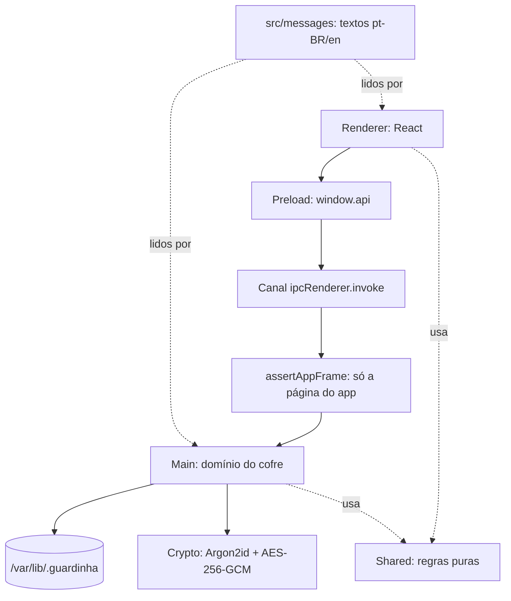

# Arquitetura



O renderer é uma interface sem privilégio: ele não abre arquivo, não usa Node e
não conhece o caminho do cofre. Tudo que importa acontece no processo main, e o
preload é a única ponte.

## Camadas

| Pasta           | Papel                                                           | Arquivo principal                                 |
| --------------- | --------------------------------------------------------------- | ------------------------------------------------- |
| `src/main/`     | Janela, sessão, IPC, cofre, criptografia e persistência         | `index.ts`, `vault.ts`, `session.ts`, `facade.ts` |
| `src/preload/`  | Fachada `window.api` registrada no `contextBridge` (build CJS)  | `index.ts` (entrypoint)                           |
| `src/renderer/` | Interface React: telas, modais, clipboard e contexto de idioma  | `App.tsx`                                         |
| `src/types/`    | Contratos compartilhados (`VaultStatus`, `ElectronApi`, opções) | `index.ts` (barrel)                               |
| `src/messages/` | Textos em pt-BR (canônico) e inglês                             | `pt-BR.ts`, `en.ts`                               |
| `src/shared/`   | Regras puras usadas pelos dois processos, sem Node nem DOM      | `strength.ts`, `strategy.ts`                      |
| `tests/`        | Suíte Vitest (main em Node, renderer em jsdom)                  | `tests/main/`, `tests/renderer/`                  |

Regras de organização: arquivo `index.ts` só reexporta (exceto os dois
entrypoints que o Electron exige) e arquivo no teto de ~500 linhas é quebrado.

### Módulos do processo main

| Arquivo         | Papel                                                                               |
| --------------- | ----------------------------------------------------------------------------------- |
| `index.ts`      | Entrypoint: janela, protocolo `guardinha://`, política da sessão, canais IPC e push |
| `vault.ts`      | Ciclo de vida do cofre (criar, desbloquear, redefinir o PIN, travar)                |
| `session.ts`    | `VaultSessionManager` (Singleton): guarda e zeragem da chave; assina o monitor      |
| `activity.ts`   | `ActivityMonitor` (Observer): temporizador de ociosidade e ouvintes de idle         |
| `unlock.ts`     | Cadeia de desbloqueio (Chain of Responsibility): trava, formato, KDF e integridade  |
| `unwrapping.ts` | Embrulho/desembrulho da chave por tipo de credencial (Factory Method)               |
| `facade.ts`     | `VaultStorageFacade` (Fachada): fs, AES-256-GCM e manifesto num ponto só            |
| `clipboard.ts`  | `SecureClipboardProxy` (Proxy): clipboard nativo com limpeza em 30 s                |
| `entries.ts`    | CRUD de credenciais sobre a fachada (sem `fs` nem cifra na mão)                     |
| `crypto.ts`     | Argon2id, AES-256-GCM, HKDF e gerador de senha                                      |
| `storage.ts`    | Persistência de baixo nível (`fs-extra`), chamada pela fachada e por `auth.ts`      |
| `auth.ts`       | Trava exponencial, `statusFrom` e validações de formato                             |

## Aliases `@zero/*`

Imports dentro de `src/` nunca usam caminho relativo entre pastas; sempre
`@zero/main/vault`, `@zero/renderer/i18n`, `@zero/types` e assim por diante.
O mapa é declarado uma vez em `tsconfig.base.json` e espelhado em três outros
arquivos, que precisam mudar juntos:

| Arquivo                    | Para que serve                                  |
| -------------------------- | ----------------------------------------------- |
| `tsconfig.base.json`       | Fonte da verdade (`paths`) para typecheck       |
| `electron.vite.config.mts` | Bundle de main, preload e renderer              |
| `vitest.config.mts`        | Suíte (mapeia `electron` para o mock)           |
| `src/node.loader.ts`       | `node --import ./src/node.loader.ts arquivo.ts` |

## Fluxo de IPC

1. A tela chama `window.api.<grupo>.<método>()` (fachada tipada).
2. O preload traduz para `ipcRenderer.invoke('<grupo>:<método>', payload)`.
3. O main valida a origem com `assertAppFrame(event)` antes de qualquer regra de
   domínio: `event.senderFrame` precisa apontar para a página oficial
   (scheme `guardinha://` em produção, dev server do Vite em desenvolvimento).
4. A função de domínio roda e devolve o valor; erro vira `Error` rejeitado com
   a mensagem **já localizada** no idioma corrente.

O contrato completo, com tabela de canais, está em `api.md`. Canal novo só
existe com tipo em `src/types/` e linha em `api.md`.

## Ciclo de vida da sessão

| Estado            | O que acontece                                                                            |
| ----------------- | ----------------------------------------------------------------------------------------- |
| Sem cofre         | `AuthModal` no modo de criação (credenciais e depois a frase)                             |
| Bloqueado         | `AuthModal` no modo de desbloqueio (PIN; mestra após 3 falhas)                            |
| Desbloqueado      | Chave do cofre no `VaultSessionManager` (Singleton), telas liberadas                      |
| Trava exponencial | Falhas contam no disco; espera crescente bloqueia o desbloqueio                           |
| Auto-lock         | 5 minutos ocioso zeram a chave na memória e bloqueiam; o main empurra `vault:auto-locked` |
| Encerramento      | `before-quit` bloqueia o cofre e solta o temporizador do clipboard                        |

O auto-lock é um Observer: o `ActivityMonitor` (`activity.ts`) dispara o
evento de ociosidade, o `VaultSessionManager` zera a chave e o entrypoint
empurra `vault:auto-locked` para o renderer (`App.tsx` assina e recarrega o
status na hora). O polling de `vault.status()` a cada 15 s continua como rede
de segurança, não como caminho principal.

## Árvore do repositório

```
Guardinha/
├── build/            ícone, script do ícone, after-pack e scripts do .deb
├── docs/             esta documentação (índice em docs/README.md)
├── src/
│   ├── main/         processo principal (cofre, criptografia, IPC)
│   ├── preload/      ponte única com a interface
│   ├── renderer/     React (componentes em src/renderer/src/components/)
│   ├── messages/     textos pt-BR e en
│   ├── shared/       regras puras compartilhadas
│   └── types/        contratos compartilhados
├── tests/            main/, renderer/, messages/, shared/ e mocks/
├── AGENTS.md         regras duras do repositório
├── CONTRIBUTING.md   fluxo de contribuição e lançamentos
└── SECURITY.md       proteções, riscos aceitos e canal de reporte
```

Os binários de `bin/` (`osv-scanner`, `shellcheck`), a pasta `out/` e o `.deb`
em `release/` não entram no git (`.gitignore`).
